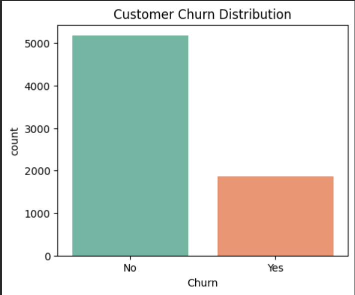
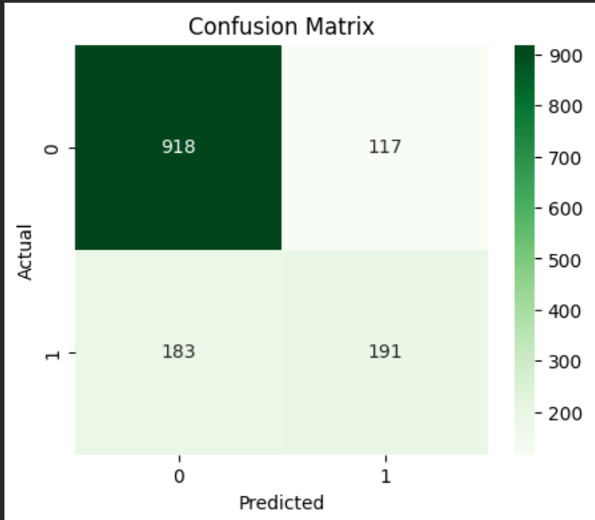
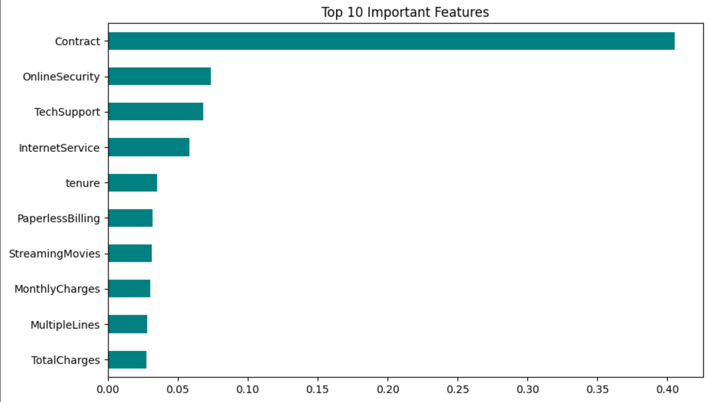

# 📞 Telco Customer Churn Prediction

An end-to-end machine learning project that predicts customer churn for a telecom company using **XGBoost**.  
It includes **data cleaning, preprocessing, visualization, feature importance, model training, and evaluation**, all built from scratch in **Google Colab**.

---

## 🧠 Project Overview

Customer churn prediction helps businesses understand why customers leave and what can be done to retain them.  
This project uses the **Telco Customer Churn dataset** to predict whether a customer will continue using the service or not, based on multiple customer attributes.

---

## 🚀 Key Features

- ✅ Complete data cleaning and preprocessing  
- 📊 Exploratory Data Analysis (EDA)  
- ⚙️ Feature encoding and scaling  
- 🤖 Model training using **XGBoost Classifier**  
- 📈 Evaluation metrics and confusion matrix visualization  
- 🔍 Feature importance graph  
- 💾 Model saving for deployment  

---

## 🧩 Tech Stack

| Tool / Library | Purpose |
|-----------------|----------|
| **Python** | Programming Language |
| **Pandas, NumPy** | Data Handling |
| **Seaborn, Matplotlib** | Data Visualization |
| **Scikit-Learn** | Preprocessing, Evaluation |
| **XGBoost** | Model Training |
| **Google Colab** | Development Environment |

---

## 📂 Dataset

**Dataset Name:** WA_Fn-UseC_-Telco-Customer-Churn.csv  
**Source:** [Kaggle - Telco Customer Churn Dataset](https://www.kaggle.com/datasets/blastchar/telco-customer-churn)

The dataset includes customer demographics, account information, and service usage details.

---

## 📸 Screenshots

| EDA | Confusion Matrix | Feature Importance |
|-----|------------------|--------------------|
|  |  |  |

---

## 🧮 Model Performance

| Metric | Score |
|--------|-------|
| **Accuracy** | ~80–85% |
| **Algorithm** | XGBoost Classifier |

---

## ⚡ How to Run

1. Upload `archive.zip` (dataset file) to Google Colab  
2. Run the Colab notebook  
3. All dependencies are installed automatically  
4. The trained model and scaler are saved as:
   - `telco_churn_model.pkl`
   - `scaler.pkl`

---

## 🧠 Insights

- Senior citizens, high monthly charges, and long-term contracts have strong influence on churn  
- Customers with fiber optic internet churn more frequently  
- Electronic check payment method is more prone to churn  

---

## 🧑‍💻 Author

**Muhammad Rayan Shahid**  
AI Engineer | Founder of [ByteBrilliance AI](https://www.youtube.com/@ByteBrillianceAI)  

🌐 [GitHub](https://github.com/MuhammadRayanShahid)  
🔗 [LinkedIn](https://www.linkedin.com/in/muhammad-rayanshahid)  
📊 [Kaggle](https://www.kaggle.com/muhammadrayans)  
🤖 [Hugging Face](https://huggingface.co/MuhammadRayanShahid)  
🎥 [YouTube](https://www.youtube.com/@ByteBrillianceAI)

---

## ⭐ Project Highlights

- Built completely in **Google Colab**
- Clean, modular, and production-ready code
- Ideal for **freelance AI portfolios** and **client demos**
- Demonstrates strong understanding of **data pipelines & model evaluation**

---

## 🏁 Final Words

This project reflects a full-cycle ML workflow —  
from **raw data → insights → model → deployment-ready artifact**.

> "Predicting churn is not just about numbers — it’s about understanding people."  
> — *ByteBrilliance AI*

---

## 🪙 License

This project is open-source under the **MIT License**.

---

**#MachineLearning #XGBoost #ChurnPrediction #AIProjects #ByteBrillianceAI**
